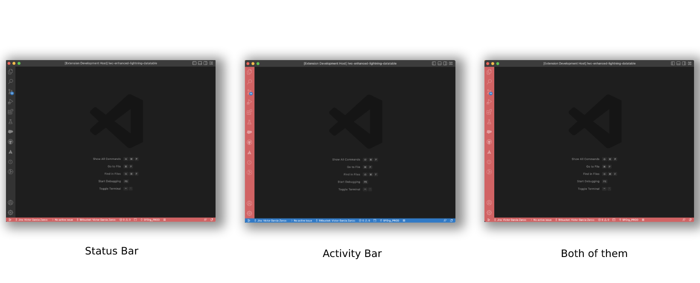

# Salesforce colORG

Stay organized, easily identify your default org and prevent unwanted deployments with Salesforce ColORG. The extension will automatically change the color of your VScode workspace based on the Salesforce org you're currently connected to. Define the set of rules and the colors to apply and start boosting your productivity!

<div align="center">
    
</div>

## How it works

Follow the steps below to configure your rules. This will identify your org aliases to apply specific colors for them.
Once configured, the extension will run in the background each time you change your default org alias (using the SFDX CLI command, the SFDX VSCode extension, etc.) and will automatically update your workspace color settings based on the rules.

### 1. Define your own rules

Go to your Visual Studio Code settings and find the Rules setting under the Salesforce ColORG extension. The rules are a list of objects with two attributes:

| Attribute | Description                                                                                                                               | Type   |
| --------- | ----------------------------------------------------------------------------------------------------------------------------------------- | ------ |
| regex     | The Regular Expression used to match your org alias                                                                                       | string |
| color     | The color in [HEX format](https://g.co/kgs/UXFjkA) that will be applied to the workspace when the RegularExpresion matches your org alias | string |

Here there's an example with two rules configured. You can add as many as you want:

```json
"sf-colorg.rules": [
	{
		"regex": "^\\w*_PROD$",
		"color": "#E15A60"
	},
	{
		"regex": "^\\w*_UAT$",
		"color": "#00AE6B"
	}
]
```

You can find here some pre-defined Regular Expressions to help you with the initial setup:
|RegEx|Description|Examples
|--|--|--|
|`^\\w*_PROD$`|Aliases finishing by _PROD|MyOrg_PROD, Customer_PROD...|
|`^UAT_\\w*$`|Aliases starging with UAT_|UAT_MyOrg, UAT_Customer...|
|`^\\w*XYZ\\w\*$`|Aliases containing XYZ|Org_XYZ, XYZ_Org, My_XYZ_Org, MyXYZOrg...|
|`^MyOrg$`|Aliases matching exactly MyOrg|MyOrg|

> Some important things to keep in mind:
>
> -   You need to escape your Regular Expression to be able to include it in the JSON settings. You can use use this online tool for [Javascript Escape / Unescape](https://codebeautify.org/javascript-escape-unescape)
> -   If your org alias matches multiple rules, only the first one will be applied
> -   If your org alias doesn't match any rule, the workspace will display the default color of your VSCode Theme
> -   Having a long list of rules might have some negative impacts on the performance, because every time your default org changes, all the rules might need to be evaluated

### 2. Specify where to apply the color

You can define whether the color will change in your VSCode workspace for the Activity Bar, the Satus Bar or both of them!

<div align="center">
		
</div>
